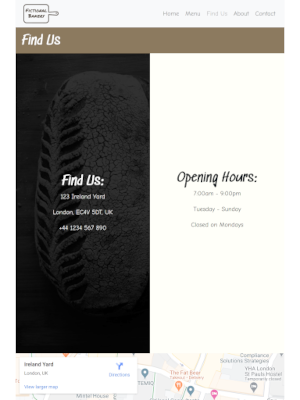

# FictionalBakery

##  User Centric Frontend Development Milestone Project
A live demo of this project can be viewed [here](https://andrewsui.github.io/tgc07-project01/index.html).

[This](https://andrewsui.github.io/tgc07-project01/index.html) is a website, created for an imaginary artisanal bakery ("FictionalBakery"), to serve as a main reference point for the general public to find out important information about the business and its products. The website consists of [home](https://andrewsui.github.io/tgc07-project01/index.html), [menu](https://andrewsui.github.io/tgc07-project01/menu.html), [find us](https://andrewsui.github.io/tgc07-project01/find-us.html), [about](https://andrewsui.github.io/tgc07-project01/about.html) and [contact](https://andrewsui.github.io/tgc07-project01/contact.html) pages.

## UX

Wireframes created during the design process can be found here: [mobile](https://github.com/andrewsui/tgc07-project01/blob/master/wireframe/wireframe-mobile.pdf) / [desktop](https://github.com/andrewsui/tgc07-project01/blob/master/wireframe/wireframe-desktop.pdf).

### User Stories
- Customers would want to be able to easily access key information about the bakery such as menu, location, opening hours, raison d’être and contact form. The bakery's address, telephone number and opening hours can be found on every page, so that it extremely easy for potential customers to find this information.
- The colour scheme uses relaxing and soothing colours to produce a natural feel and tone for the website and the fonts used look handwritten. Together, the colour scheme and typography embody the business owners' goals for the bakery: to make the best bread and pastries they can, with as few ingredients as possible. The website serves as an information resource that does not need to change on a frequent basis. For more frequent customer engagement, the bakery's social media accounts would mainly be used instead, as such there are also social media links on every page.

#### Home Page

- [Home page](https://andrewsui.github.io/tgc07-project01/index.html) - Customers should immediately be able to identify that the website is for a bakery. From the title and picture, customers are able to understand the business' ethos.
- [Home page](https://andrewsui.github.io/tgc07-project01/index.html) - The bakery's owners goal of this page is to make it obvious to visitors that the website is for a bakery and to also portray the business' values and culture. The home page demonstrates the business' artisanal, rustic, high quality and welcoming ideologies.

#### Menu Page

- [Menu page](https://andrewsui.github.io/tgc07-project01/menu.html) - Customers would like to preview the menu items and prices, without having to visit the bakery in person. They would also want to see the quality of the bakery's products.
- [Menu page](https://andrewsui.github.io/tgc07-project01/menu.html) - The image slideshow on this page enables the business owners to be able to show a sample of what their products look like, which reiterates the quality and care taken in producing them. Having the prices easily accessible to visitors demonstrates the bakery's transparency and openness.

#### Find Us Page

- [Find Us page](https://andrewsui.github.io/tgc07-project01/find-us.html) - The customer and business owners' goals are exactly the same for this page, whereby it must be totally clear where the bakery is located and the associated opening hours. A map is also embedded at the bottom of the page for additional help in finding the premises.

#### About Us Page

- [About Us page](https://andrewsui.github.io/tgc07-project01/about.html) - This page gives customers a behind-the-scenes view into the baking process, which is also shown in the YouTube video embedded at the bottom of the page. Through this page, customers are able to understand the care taken throughout the entire process behind the bakery's products.
- [About Us page](https://andrewsui.github.io/tgc07-project01/about.html) - The business owners use this page to provide further insight into the baking process, ingredients used and the freshness of the produce, justifying why the products are more expensive than mass produced supermarket products.

#### Contact Us Page

- [Contact Us page](https://andrewsui.github.io/tgc07-project01/contact.html) - Customers or potential employees may wish to contact the business owners, therefore this contact form is an easy way of accomplishing this.
- [Contact Us page](https://andrewsui.github.io/tgc07-project01/contact.html) - The business owners may not wish to publicly display their email address, so this contact form would be a simple yet easy way for the public to contact the business owners.

## Features

### Current Features
- Responsive web design that automatically adjusts the way content is displayed on different screen sizes. In general, a single column is used for mobile devices and two columns for medium screen sizes and up. When two columns have still been used for mobile devices, the font size has been slightly reduced so that text is not so cramped, whilst still being legible.
- The navbar links are disabled for the page that the user is currently on.
- The [menu](https://andrewsui.github.io/tgc07-project01/menu.html) page features an infinitely looping image slideshow for each section of the bakery's menu. The lines joining the menu items and their respective prices are reponsive, changing in length automatically for different screen sizes.
- The [find us](https://andrewsui.github.io/tgc07-project01/find-us.html) page includes an embedded map using [Google Maps](https://www.google.com/maps/place/Ireland+Yard,+London,+UK/@51.512778,-0.10179,19z/).
- The [about](https://andrewsui.github.io/tgc07-project01/about.html) page includes an embedded video from [YouTube](https://www.youtube.com/watch?v=73oENaDiq04).
- The [contact](https://andrewsui.github.io/tgc07-project01/contact.html) page requires all fields to be filled in before the submit button can be activated. The submit button redirects to a [separate web page](https://andrewsui.github.io/tgc07-project01/contact-submit.html) to thank the user for their message.
- External links open in new tabs.

### Features Left to Implement
- Change home page main image to one where baker is not wearing any accessories.
- Change menu page images to ones with lighter backgrounds to give the page a brighter look.
- Contact page submit button should send an email to business' email address.
- Contact form's field validation should be more robust.
- Contact page submit button currently redirects to a separate page to thank user for submitting a message, but a modal might be a better user experience.

## Technologies Used

- HTML
- CSS
- [Bootstrap v4.5](https://getbootstrap.com/docs/4.5/getting-started/introduction/)

## Testing

All testing was done manually. The following tests were performed:

1. [Menu](https://andrewsui.github.io/tgc07-project01/menu.html):
  - Verified image slideshow keeps looping for as long as website was left open and displayed as expected.

2. [Find us](https://andrewsui.github.io/tgc07-project01/find-us.html):
  - Verified that embedded map was able to be interacted with and the "view larger map" link successfully opened Google Maps in a new tab.

3. [About](https://andrewsui.github.io/tgc07-project01/about.html):
  - Verified that embedded YouTube video played as expected.

4. [Contact](https://andrewsui.github.io/tgc07-project01/contact.html) page:
  - Tried to submit the empty form and verified that an error message about the required fields appeared.
  - Tried to submit the form with an invalid email address and verified that a relevant error message appeared.
  - Tried to submit the form with all inputs valid and verified that the user is redirected to a page displaying a thank you message.

5. Navbar links:
  - All navbar links were checked to verify they linked to the correct pages and that they were disabled for the current page the user was on.

6. Telephone number for the bakery on all pages:
  - Verified that the link successfuly redirected phone call app on mobile device.

7. Social media links on all pages:
  - Verified that the facebook and instagram links open in new tabs on PCs.

8. W3C [Markup Validation Service](https://validator.w3.org/) and [CSS Validation Service](https://jigsaw.w3.org/css-validator/) were used to check the project's HTML and CSS code respoectively. HTML warnings were identified by the validator, but these were in relation to section HTML parent tags not having child headers within, and the flow of the websites did not require headers in these sections. CSS errors were flagged by the validator, but these were in relation to colour variables used in the CSS files. This appears to be an error with the validator service, because after manually testing the project on numerous devices, I did not encounter any bugs pertaining to the use of CSS colour variables.

To check compatibility and the layout's responsiveness the website was tested using different browsers (Chrome, FireFox and Safari) across a range of devices (Android and iOS mobile and tablet devices, and Windows and Ubuntu PCs.

## Deployment

A live demo of this project can be viewed [here](https://andrewsui.github.io/tgc07-project01/index.html) which has been hosted using GitHub Pages.
All the source code for this project is available [here](https://github.com/andrewsui/tgc07-project01) on GitHub.

Code for the project was deployed in the following manner:
- Individual files were added to the next commit staging area by executing the `git add [filename]` command in a command-line interface.
- All changes in the working directory were added to the next commit (stage) by executing the `git add .` command in a command-line interface.
- Staged content was committed as new commit snapshot by executing the `git commit -m “[message]"` command in a command-line interface.
- Local branch commits were pushed to the remote repository master branch by executing the `git push -u origin master` command in a command-line interface.
- The website was published on GitHub Pages by navigating to the "Settings" of the project's repository and selecting the master branch as the source in the GitHub Pages sub-section.

## Credits

### Content and Media
- The photos used in this project were obtained from [Unsplash](https://unsplash.com/)
- The bakery's logo design used in this project was created using [FreeLogoDesign](https://www.freelogodesign.org/)
- The facebook and instagram logos used in this project were obtained from [Iconfinder](https://www.iconfinder.com/)
- The embedded map on the [find us](https://andrewsui.github.io/tgc07-project01/find-us.html) page linked using [Google Maps](https://www.google.com/maps/place/Ireland+Yard,+London,+UK/@51.512778,-0.10179,19z/)
- The video on the [about](https://andrewsui.github.io/tgc07-project01/about.html) page was linked from [PARAGRAPHIC's YouTube channel](https://www.youtube.com/channel/UCQtzPvhc-8PQrmxcZUVdI7Q), with the original video being hosted [here](https://www.youtube.com/watch?v=73oENaDiq04).

### Acknowledgements

- I received inspiration for the [menu](https://andrewsui.github.io/tgc07-project01/menu.html) page's image slideshow from [this](https://www.urbaninfluence.com/make-a-background-image-slider-with-css-keyframes/) website and the HTML and CSS code was adapted from it.
- I used [this](https://cubic-bezier.com/) website to determine cubic-bezier function values in order to customise the above image slideshow's animation-timing.
